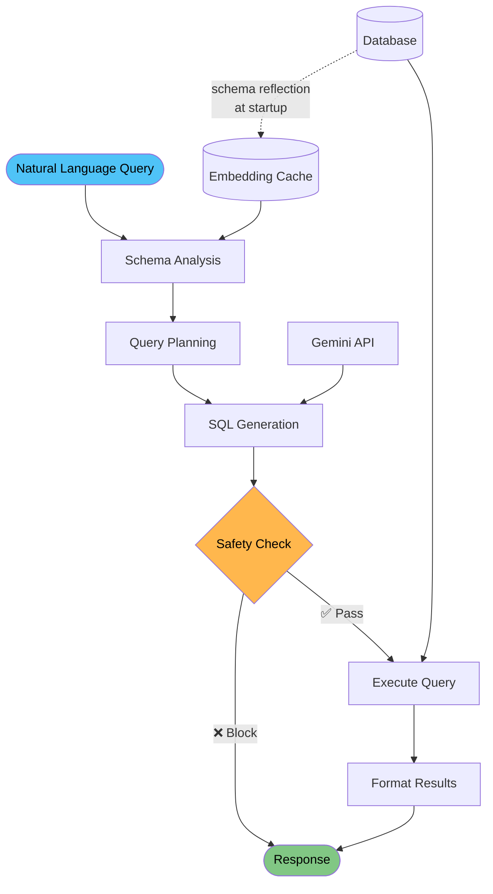

# Netquery - Network Infrastructure Text-to-SQL

An AI-powered assistant that converts natural language queries into SQL. Optimized for network infrastructure monitoring with automatic chart generation and comprehensive safety validation.

## Architecture Overview



## Key Features

### 🎯 **Smart Query Understanding**
- **Semantic Schema Analysis**: Identifies relevant tables using AI-powered similarity matching
- **Domain-Optimized**: Enhanced for network infrastructure terminology and concepts
- **Multi-Table Joins**: Handles complex relationships across load balancers, servers, and monitoring data

### 🛡️ **Safety-First Design**
- **Read-Only Operations**: Blocks all destructive operations (DELETE, DROP, UPDATE) by design
- **Multi-Layer Validation**: Every query passes through safety checks before execution
- **Query Optimization**: Automatically adds LIMIT clauses for large result sets

### 📊 **Automatic Visualizations**
- **Line Charts**: Time-series data and trends over time
- **Bar Charts**: Comparative analysis and distributions
- **Scatter Plots**: Correlation analysis and relationships
- **Static SVG**: Charts work in any browser without JavaScript dependencies

### 🔌 **Integration Ready**
- **MCP Protocol**: Works with any AI assistant supporting Model Context Protocol
- **CLI Interface**: Direct command-line testing and exploration
- **Export Options**: HTML reports, CSV data, and reasoning explanations

## Quick Start

### Prerequisites
- Python 3.8+
- Gemini API key from [Google AI Studio](https://aistudio.google.com/)

### Installation

1. **Clone and setup:**
   ```bash
   git clone https://github.com/keo571/netquery.git
   cd netquery
   pip install -r requirements.txt
   ```

2. **Configure environment:**
   ```bash
   cp .env.example .env
   # Edit .env and add your GEMINI_API_KEY
   ```

3. **Create sample data** (Required):
   ```bash
   python scripts/create_sample_data.py
   ```
   This creates `data/infrastructure.db` with realistic network infrastructure data.
   
   **Note:** This step is required for CLI and direct Python usage. Only the MCP server auto-creates sample data if missing.

## Usage Examples

### CLI Interface
```bash
# Basic queries
python gemini_cli.py "Show me all load balancers"
python gemini_cli.py "Which servers have high CPU usage?"

# Analytics with charts
python gemini_cli.py "Show network traffic trends over time" --html
python gemini_cli.py "Display server performance by datacenter" --csv

# Complex multi-table queries  
python gemini_cli.py "Show unhealthy load balancers with their backend servers" --explain
```

### MCP Server (for AI Assistants)
```bash
python -m src.text_to_sql.mcp_server
```

### Direct Python API
```python
from src.text_to_sql.pipeline.graph import text_to_sql_graph
from langchain_core.messages import HumanMessage

result = await text_to_sql_graph.ainvoke({
    "messages": [HumanMessage(content="Show load balancer health over time")],
    "original_query": "Show load balancer health over time"
})
```

## Query Examples

For comprehensive query examples organized by complexity level, see **[docs/SAMPLE_QUERIES.md](docs/SAMPLE_QUERIES.md)**.

## Configuration

Environment variables:

```bash
# Required: Gemini API Key for Text-to-SQL generation
GEMINI_API_KEY=your_api_key_here

# Optional: Override default database location
DATABASE_URL=sqlite:///data/infrastructure.db
```

## Project Structure

```
├── src/text_to_sql/           # Core pipeline implementation
│   ├── pipeline/              # LangGraph processing stages
│   │   ├── graph.py          # Main orchestration
│   │   ├── state.py          # State management  
│   │   └── nodes/            # Processing nodes
│   ├── tools/                # Database and analysis tools
│   ├── utils/                # Chart generation and exports
│   ├── database/             # Database connection management
│   └── mcp_server.py         # MCP server implementation
├── scripts/                  # Data generation and utilities
│   ├── create_sample_data.py # Sample data generator
│   ├── evaluate_queries.py   # Query evaluation framework
│   ├── evaluate_mcp.py       # MCP tool selection testing
│   └── export_database_tables.py # Database export utility
├── outputs/                  # User-facing results (gitignored)
│   ├── query_data/           # CSV exports from queries
│   └── query_reports/        # HTML reports from queries  
├── testing/                  # Testing artifacts (gitignored)
│   ├── table_exports/        # Database table exports
│   └── evaluations/          # Evaluation reports
├── docs/                     # Documentation and examples
│   └── SAMPLE_QUERIES.md     # Comprehensive query examples
└── gemini_cli.py             # Command-line interface
```

## Pipeline Architecture

1. **Schema Analysis** → Identifies relevant tables using semantic similarity
2. **Query Planning** → Determines required joins, filters, and aggregations
3. **SQL Generation** → Uses Gemini AI to create optimized SQL queries
4. **Safety Validation** → Ensures read-only operations and safe execution
5. **Query Execution** → Runs validated SQL with proper error handling
6. **Result Formatting** → Generates charts and human-readable responses

## Development & Testing

### Run Tests
```bash
# Test with CLI queries
python gemini_cli.py "Show server performance by datacenter" --html

# Test MCP server (tool selection)
python scripts/evaluate_mcp.py

# Comprehensive pipeline evaluation
python scripts/evaluate_queries.py

# Export database tables for analysis  
python scripts/export_database_tables.py
```

## License

MIT License - see [LICENSE](LICENSE) file for details.