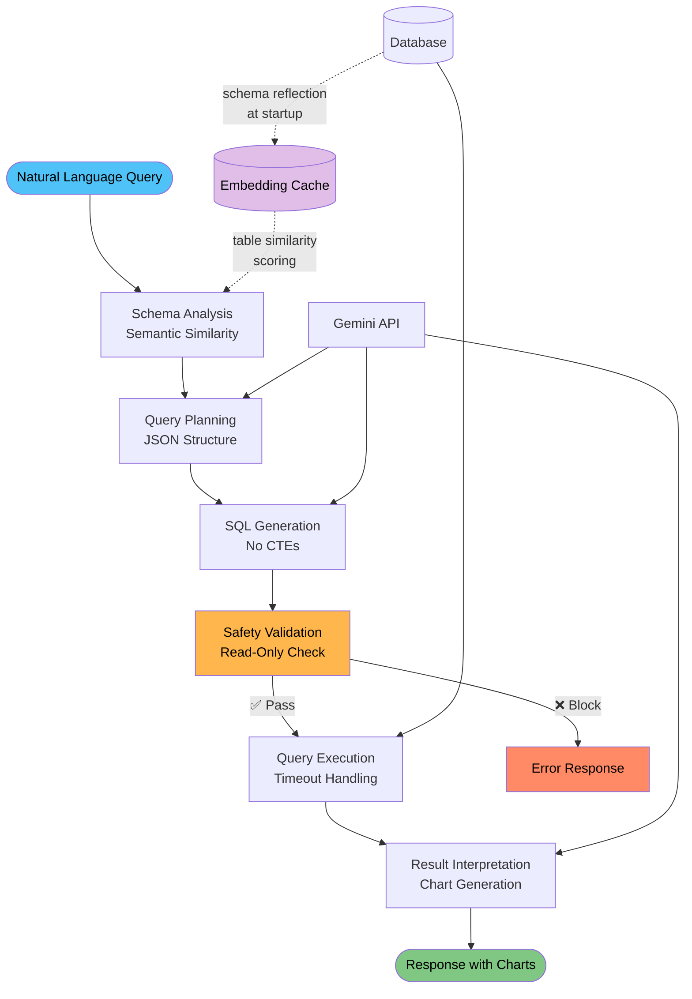

# Netquery - Network Infrastructure Text-to-SQL

An AI-powered assistant that converts natural language queries into SQL. Optimized for network infrastructure monitoring with automatic chart generation and comprehensive safety validation.

## Architecture Overview



## Key Features

### 🎯 **Smart Query Understanding**
- **Semantic Table Discovery**: Automatically finds relevant database tables using sentence transformer embeddings
- **Network Infrastructure Focused**: Specialized for load balancers, servers, VIPs, and monitoring data
- **Multi-Table Support**: Handles complex relationships using database schema reflection
- **Structured Planning**: Creates JSON execution plans with joins, filters, and aggregations

### 🛡️ **Safety & Performance**
- **Read-Only Architecture**: Blocks all destructive operations (DELETE, DROP, UPDATE, CREATE)
- **Timeout Protection**: Dual-level timeouts (30s evaluation, 45s database) prevent hangs
- **Smart Limits**: Automatic LIMIT clauses and performance warnings for large datasets
- **Error Recovery**: Multi-layer validation with retry logic for failed SQL generation

### 📊 **Automatic Visualizations**
- **Smart Chart Detection**: Automatically detects optimal chart types based on data patterns
- **Time-Series Support**: Built-in support for performance trends and monitoring metrics
- **Static SVG Output**: Charts work everywhere without JavaScript dependencies
- **HTML Reports**: Integrated visualizations in exported HTML reports

### 🔌 **Multiple Interfaces**
- **MCP Protocol**: Works with Claude, ChatGPT, and other AI assistants
- **Command Line**: CLI with export options (--html, --csv) and detailed explanations (--explain)
- **Export Formats**: HTML reports with charts, CSV data, structured JSON responses
- **Testing Framework**: Built-in evaluation suite with comprehensive performance metrics

## Quick Start

### Prerequisites
- Python 3.8+
- Gemini API key from [Google AI Studio](https://aistudio.google.com/)

### Installation

1. **Clone and setup:**
   ```bash
   git clone https://github.com/keo571/netquery.git
   cd netquery
   pip install -r requirements.txt
   ```

2. **Configure environment:**
   ```bash
   cp .env.example .env
   # Edit .env and add your GEMINI_API_KEY
   ```

3. **Create sample data** (Required):
   ```bash
   python scripts/create_sample_data.py
   ```
   This creates `data/infrastructure.db` with realistic network infrastructure data.
   
   **Note:** This step is required for CLI and direct Python usage. Only the MCP server auto-creates sample data if missing.

## Usage Examples

### CLI Interface
```bash
# Basic queries
python gemini_cli.py "Show me all load balancers"
python gemini_cli.py "Which servers have high CPU usage?"

# Analytics with charts
python gemini_cli.py "Show network traffic trends over time" --html
python gemini_cli.py "Display server performance by datacenter" --csv

# Complex multi-table queries  
python gemini_cli.py "Show unhealthy load balancers with their backend servers" --explain
```

### MCP Server (for AI Assistants)
```bash
python -m src.text_to_sql.mcp_server
```

### Direct Python API
```python
from src.text_to_sql.pipeline.graph import text_to_sql_graph
from langchain_core.messages import HumanMessage

result = await text_to_sql_graph.ainvoke({
    "messages": [HumanMessage(content="Show load balancer health over time")],
    "original_query": "Show load balancer health over time"
})
```

## Query Examples

For comprehensive query examples organized by complexity level, see **[docs/SAMPLE_QUERIES.md](docs/SAMPLE_QUERIES.md)**.

## Configuration

Environment variables:

```bash
# Required: Gemini API Key for Text-to-SQL generation
GEMINI_API_KEY=your_api_key_here

# Optional: Override default database location
DATABASE_URL=sqlite:///data/infrastructure.db
```

## Project Structure

```
├── src/text_to_sql/           # Core pipeline implementation
│   ├── pipeline/              # LangGraph processing stages
│   │   ├── graph.py          # Main orchestration
│   │   ├── state.py          # State management
│   │   └── nodes/            # Six processing nodes
│   ├── database/             # Database connection management
│   ├── tools/                # Database and analysis tools
│   │   ├── database_toolkit.py # Database operations
│   │   ├── semantic_table_finder.py # Table relevance scoring
│   │   └── safety_validator.py # Query safety validation
│   ├── utils/                # Chart generation and utilities
│   │   ├── chart_generator.py # SVG chart generation
│   │   ├── html_exporter.py  # HTML report generation
│   │   ├── llm_utils.py      # LLM configuration
│   │   └── sql_utils.py      # SQL parsing utilities
│   ├── prompts/              # LLM prompts for each stage
│   ├── config.py             # Configuration management
│   └── mcp_server.py         # MCP server implementation
├── scripts/                  # Data generation and evaluation
│   ├── create_sample_data.py # Sample data generator
│   ├── evaluate_queries.py   # Query evaluation framework
│   └── export_database_tables.py # Database export utility
├── data/                     # Database files
│   └── infrastructure.db     # SQLite database (auto-created)
├── outputs/                  # Query results (gitignored)
│   ├── query_data/           # CSV exports from queries
│   └── query_reports/        # HTML reports with charts
├── testing/                  # Testing artifacts (gitignored)
│   ├── table_exports/        # Database table exports
│   └── evaluations/          # Evaluation reports
├── docs/                     # Documentation and examples
│   └── SAMPLE_QUERIES.md     # Comprehensive query examples
└── gemini_cli.py             # Command-line interface
```

## Pipeline Architecture

1. **Schema Analysis** → Uses semantic similarity to identify relevant tables from embeddings cache
2. **Query Planning** → Creates structured JSON execution plan with joins, filters, and aggregations
3. **SQL Generation** → Generates optimized SQLite queries (blocks CTEs, uses subqueries)
4. **Safety Validation** → Enforces read-only operations, blocks destructive queries
5. **Query Execution** → Runs SQL with timeout protection and error handling
6. **Result Interpretation** → Generates charts, formats responses, and provides insights

## Development & Testing

### Run Tests
```bash
# Test with CLI queries
python gemini_cli.py "Show server performance by datacenter" --html

# Comprehensive pipeline evaluation
python scripts/evaluate_queries.py

# Export database tables for analysis  
python scripts/export_database_tables.py
```

## License

MIT License - see [LICENSE](LICENSE) file for details.