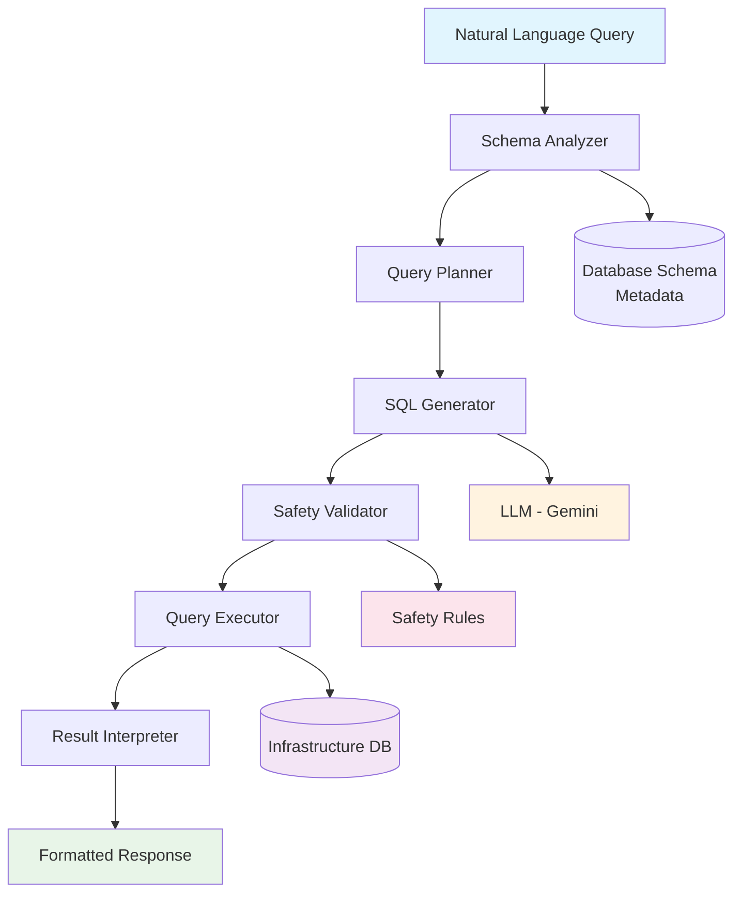

# Netquery - Network Infrastructure Text-to-SQL

An AI-powered assistant that converts natural language queries into SQL. Currently includes sample network infrastructure data for demonstration, but can be adapted for various database schemas and domains.

## Architecture Overview



## Why Netquery? Design Advantages

### 🎯 **Semantic Understanding**
- **Schema Intelligence**: Uses semantic similarity to identify relevant tables based on natural language context
- **Domain Adaptable**: Currently demonstrates network infrastructure concepts but can be adapted to other domains

### 🛡️ **Safety-First Architecture**
- **Multi-Layer Validation**: Every query passes through safety checks before execution
- **Read-Only Operations**: Blocks all destructive operations (DELETE, DROP, UPDATE) by design
- **Result Limits**: Automatically adds LIMIT clauses to prevent runaway queries

### ⚡ **Performance & Scalability**
- **Smart Schema Analysis**: Uses semantic similarity to identify relevant tables, reducing query complexity
- **Pipeline Architecture**: LangGraph-based processing allows for easy optimization and monitoring
- **Efficient Caching**: Schema metadata is cached to reduce repeated analysis overhead

### 🔌 **Integration Ready**
- **MCP Protocol**: Works with any AI assistant supporting Model Context Protocol
- **Modular Design**: Each pipeline stage can be customized or replaced independently
- **API Ready**: Easy to integrate into existing monitoring dashboards and tools

## Query Examples

Transform natural language into SQL queries (using sample infrastructure data):

- **"Show me all load balancers that are unhealthy"**
- **"Which SSL certificates expire in the next 30 days?"** 
- **"What's the average CPU utilization by datacenter?"**
- **"List all VIP addresses in production environment"**

## Sample Data Schema

The included sample database contains network infrastructure entities for demonstration:

- **Load Balancers** - F5, HAProxy, Nginx configurations
- **Backend Servers** - Pool members, real servers, health status
- **Virtual IPs (VIPs)** - Virtual services, IP addresses
- **Data Centers** - Sites, regions, availability zones  
- **SSL Certificates** - TLS certificates, expiration tracking
- **Monitoring Metrics** - Performance data, utilization statistics

## Quick Start

### Prerequisites
- Python 3.8+
- Gemini API key from [Google AI Studio](https://aistudio.google.com/)

### Installation

1. **Clone the repository:**
   ```bash
   git clone <your-repo-url>
   cd netquery
   ```

2. **Install dependencies:**
   ```bash
   pip install -r requirements.txt
   ```

3. **Set up environment:**
   ```bash
   cp .env.example .env
   # Edit .env and add your GEMINI_API_KEY
   ```

4. **Create sample data** (Required first step):
   ```bash
   python -m src.text_to_sql.create_sample_data
   ```
   
   This creates `infrastructure.db` with realistic network infrastructure data including load balancers, servers, SSL certificates, VIP pools, and backend mappings.

### Usage Examples

**Direct Python Usage:**
```python
from src.text_to_sql.pipeline.graph import text_to_sql_graph
from langchain_core.messages import HumanMessage

# Query your infrastructure
result = await text_to_sql_graph.ainvoke({
    "messages": [HumanMessage(content="Show me all unhealthy load balancers")],
    "original_query": "Show me all unhealthy load balancers"
})
```

**CLI Testing:**
```bash
# Simple CLI for testing (requires sample data)
python gemini_cli.py "Show me all load balancers"
python gemini_cli.py "Which SSL certificates expire soon?"
```

**MCP Server (for AI assistants):**
```bash
# Start the MCP server (requires sample data)
python -m src.text_to_sql.mcp_server
```

## Common Query Patterns

### Status Monitoring
```
"Show me all load balancers that are down"
"Which backend servers are unhealthy?" 
"List servers in maintenance mode"
```

### Performance Analysis
```
"What's the average response time by datacenter?"
"Show bandwidth utilization trends"
"Which servers have CPU usage above 80%?"
```

### Security & Compliance
```
"Which SSL certificates expire in the next 90 days?"
"List all VIPs without valid certificates"
"Show load balancers with weak SSL configurations"
```

### Capacity Planning
```
"What's the current load distribution across datacenters?"
"Show server utilization by region"
"Which load balancers are approaching capacity limits?"
```

## Project Structure

```
src/text_to_sql/
├── pipeline/           # LangGraph-based processing pipeline
│   ├── graph.py       # Main orchestration
│   ├── state.py       # State management
│   └── nodes/         # Processing nodes
├── tools/             # Database and analysis tools
│   ├── database_toolkit.py    # Database operations
│   ├── safety_validator.py    # Query safety checks
│   └── semantic_table_finder.py # Schema analysis
├── prompts/           # LLM prompts for each stage
├── utils/             # SQL utilities and helpers
├── database/          # Database connection management
├── create_sample_data.py      # Network infrastructure sample data
└── mcp_server.py             # MCP server implementation
```

## Configuration

Key environment variables:

```bash
# Required
GEMINI_API_KEY=your_api_key_here

# Optional  
DATABASE_URL=sqlite:///infrastructure.db
LOG_LEVEL=INFO
MAX_RESULT_ROWS=1000
LLM_MODEL=gemini-2.5-flash
```

## Detailed Architecture

### Pipeline Stages

1. **Schema Analyzer** - Reads database schema metadata (table names, columns, relationships) and uses semantic similarity to identify relevant tables from natural language context
2. **Query Planner** - Analyzes query intent, determines required joins, filters, and aggregations needed
3. **SQL Generator** - Leverages LLM to convert the planned query into syntactically correct, optimized SQL
4. **Safety Validator** - Multi-layer security checks to prevent destructive operations and enforce business rules
5. **Query Executor** - Executes validated SQL against the database with proper error handling and timeouts
6. **Result Interpreter** - Formats raw SQL results into human-readable responses with insights and explanations

### Technical Implementation

- **LangGraph Framework**: Orchestrates the multi-stage pipeline with state management and error handling
- **Semantic Table Discovery**: Uses sentence transformers to match queries with relevant database schemas
- **LLM Integration**: Google Gemini API for intelligent SQL generation with domain-specific prompts
- **SQLAlchemy ORM**: Database abstraction layer supporting multiple database backends
- **MCP Protocol**: Standard interface for AI assistant integration

## Development

### Testing

**Prerequisites**: Always create sample data first:
```bash
# Create sample infrastructure database
python -m src.text_to_sql.create_sample_data
```

**Test with CLI:**
```bash
# Try different complexity queries
python gemini_cli.py "Show me all load balancers"
python gemini_cli.py "Which servers have high CPU usage?"
python gemini_cli.py "What's the average memory usage by datacenter?"
```

**Test with MCP:**
```bash
# Start MCP server
python -m src.text_to_sql.mcp_server
```

See `SAMPLE_QUERIES.md` for comprehensive test cases organized by complexity level.

### Adding New Infrastructure Types

1. Update sample data patterns in `create_sample_data.py`
2. Add domain knowledge to prompts in `prompts/`
3. Update schema analysis in `tools/semantic_table_finder.py`

## Contributing

1. Follow Python best practices and type hints
2. Focus on network infrastructure use cases
3. Ensure safety validation for all new query types
4. Add appropriate logging and error handling

## License

[Your License Here]

## Support

For network infrastructure-specific questions or feature requests, please open an issue describing your use case and the types of queries you need to support.