# Netquery - Network Infrastructure Text-to-SQL

An AI-powered assistant that converts natural language queries into SQL. Optimized for network infrastructure monitoring with automatic chart generation and comprehensive safety validation.

## Architecture Overview

### 7-Stage Pipeline with Intent Classification & SQL Caching

```mermaid
flowchart TD
    A([Natural Language Query]) --> IC[Stage 0: Intent Classifier<br/>LLM-Powered ~200ms]
    IC -->|General Question| GA[Direct Answer<br/>Skip SQL Pipeline]
    IC -->|SQL Query| CL[Stage 1: Cache Lookup<br/>Check SQL Cache]
    IC -->|Mixed Query| SPLIT[Split Query<br/>Extract Both Parts]

    SPLIT -->|general_answer| STORE[Store Answer<br/>For Response]
    SPLIT -->|sql_query| CL

    CL -->|🚀 HIT ~10ms| V[Stage 4: Safety Validation<br/>Read-Only Check]
    CL -->|❌ MISS ~2.5s| B[Stage 2: Schema Analysis<br/>Semantic Table Selection]

    B --> C[Stage 3: SQL Generation<br/>LLM Call]
    C --> V
    V -->|✅ Pass| E[Stage 5: Query Execution<br/>Timeout Handling]
    V -->|❌ Block| H[Error Response]
    E --> F[Stage 6: Result Interpretation<br/>Chart Generation]
    STORE -.->|prepend| F
    F --> G([Response with Charts])

    DB[(Database)] -.->|schema at startup| SCHEMA_CACHE
    SCHEMA_CACHE[(Schema Embeddings)] -.->|similarity scoring| B
    SQL_CACHE[(SQL Cache)] -.->|lookup| CL
    LLM[Gemini API] --> IC
    LLM --> C
    LLM --> F
    DB --> E

    style A fill:#4FC3F7,color:#000
    style IC fill:#B39DDB,color:#000
    style CL fill:#9FA8DA,color:#000
    style G fill:#81C784,color:#000
    style GA fill:#81C784,color:#000
    style H fill:#FF8A65,color:#000
    style V fill:#FFB74D,color:#000
    style SPLIT fill:#FFE082,color:#000
    style STORE fill:#FFE082,color:#000
    style SCHEMA_CACHE fill:#E1BEE7,color:#000
    style SQL_CACHE fill:#CE93D8,color:#000
```



**Performance:**
- **Intent Classification**: ~200ms (LLM call for every query)
- **Cache HIT**: ~210ms total (200ms intent + 10ms cache lookup)
- **Cache MISS**: ~2.7s total (200ms intent + 2.5s SQL generation)
- **General Questions**: ~200ms (intent classifier answers directly, no SQL)

**Intent-Based Routing:**
- **General**: Knowledge questions (e.g., "What is a load balancer?") → Direct answer, skip SQL pipeline
- **SQL**: Pure database queries (e.g., "Show all servers") → Continue to cache lookup
- **Mixed**: Both general + SQL (e.g., "What is DNS? Show DNS records") → Provide both answer and data

**Conversational Follow-Up Handling:**
- Extracts current question from conversation context
- Rewrites ambiguous follow-ups (e.g., "which are unhealthy?" → "Show unhealthy servers")
- Uses rewritten query for cache matching and table selection

See [docs/ARCHITECTURE_DECISION.md](docs/ARCHITECTURE_DECISION.md) for detailed pipeline design.

## Quick Start

### Prerequisites
- Python 3.9+
- Gemini API key from [Google AI Studio](https://aistudio.google.com/app/apikey)

### 1. Install
```bash
git clone https://github.com/keo571/netquery.git
cd netquery
python3 -m venv .venv
source .venv/bin/activate  # Windows: .venv\Scripts\activate
pip install -r requirements.txt
```

### 2. Configure API Key
```bash
# Edit .env.sample and add your API key
# GEMINI_API_KEY=your_actual_key_here
```

### 3. Setup Database

Use the setup script to create sample database and embeddings:

```bash
./setup-cli.sh
```

This automatically:
- Creates the sample SQLite database with demo data
- Builds semantic embeddings for table discovery
- Configures `.env` for CLI usage

**Manual setup** (if needed):
```bash
# Create database
python scripts/create_sample_data.py

# Build schema embeddings
python -m src.schema_ingestion build \
  --schema-id sample \
  --excel-path schema_files/sample_schema.xlsx \
  --output-path schema_files/sample_schema.json
```

See [docs/SCHEMA_INGESTION.md](docs/SCHEMA_INGESTION.md) for advanced usage.

### 4. Start API Server

**For Frontend Integration (Recommended):**
```bash
# Dual backends - supports database switching in frontend
./start-dual-backends.sh
# Sample: http://localhost:8000
# Neila:  http://localhost:8001

# Development mode with auto-reload
./start-dual-backends.sh --dev

# Or single backend
SCHEMA_ID=sample python -m src.api.server --port 8000
```

**For Quick Testing (CLI):**
```bash
python gemini_cli.py "Show me all load balancers"
```

### 5. Access API Documentation

Once the server is running:
- **API Docs**: http://localhost:8000/docs
- **Sample Backend**: http://localhost:8000
- **Neila Backend**: http://localhost:8001 (if using dual backends)

---

## Usage Examples

### API Server (Primary Usage)

**Main Endpoints:**
```bash
# 1. Generate SQL from natural language
POST http://localhost:8000/api/generate-sql
Body: {"query": "Show me all load balancers"}

# 2. Execute SQL and get preview
GET http://localhost:8000/api/execute/{query_id}

# 3. Get LLM interpretation and chart suggestions
POST http://localhost:8000/api/interpret/{query_id}

# 4. Download full results as CSV
GET http://localhost:8000/api/download/{query_id}

# 5. Get schema overview and suggested queries
GET http://localhost:8000/api/schema/overview
```

**Interactive API Documentation:**
- Visit http://localhost:8000/docs for Swagger UI
- Test all endpoints directly in the browser

**Testing:**
```bash
# Run API integration tests
python -m pytest testing/api_tests/test_api.py
python -m pytest testing/api_tests/test_llm_interpretation.py
```

### CLI Interface (Quick Testing)

```bash
# Basic query
python gemini_cli.py "Show me all load balancers"

# With HTML export
python gemini_cli.py "Show network traffic trends" --html

# With detailed explanation
python gemini_cli.py "Show unhealthy backends" --explain
```

For more CLI examples, see [docs/SAMPLE_QUERIES.md](docs/SAMPLE_QUERIES.md).

### MCP Server (for AI Assistants)
```bash
python -m src.text_to_sql.mcp_server
```

## Frontend Integration

The backend can serve the React frontend directly for production deployments.

### Development Mode (Separate Servers)

Run frontend and backend separately for hot reload and database switching:

```bash
# Terminal 1: Start dual backends
./start-dual-backends.sh --dev    # sample:8000 + neila:8001

# Terminal 2: Start frontend dev server (in netquery-insight-chat repo)
cd ../netquery-insight-chat
npm start                          # Frontend on :3000
```

**Access:** http://localhost:3000
- ✅ Database switching enabled
- ✅ Hot reload on frontend changes

### Production Mode (Single URL)

Backend serves the React build directly - single URL for users:

```bash
# 1. Build frontend (in netquery-insight-chat repo)
cd ../netquery-insight-chat
npm run build

# 2. Start backend (serves frontend + API)
cd ../netquery
SCHEMA_ID=neila python -m src.api.server --port 8001
```

**Access:** http://localhost:8001 (or your server IP/domain)
- ❌ Database switching disabled (single DB per URL)
- ✅ Zero-config deployment
- ✅ No CORS configuration needed

The backend looks for the React build at `../netquery-insight-chat/build/` by default. Override with `STATIC_DIR` environment variable.

### Frontend Repository

- **[netquery-insight-chat](https://github.com/keo571/netquery-insight-chat)** - React web interface
  - Pure React/JavaScript (no Python dependencies)
  - Same-origin detection for automatic API routing
  - Schema visualization using ReactFlow
  - See the frontend README for detailed setup

## Direct Python API
```python
from src.text_to_sql.pipeline.graph import text_to_sql_graph

# Async usage
result = await text_to_sql_graph.ainvoke({
    "original_query": "Show load balancer health over time",
    "show_explanation": False,
    "export_csv": False,
    "export_html": False
})

# Sync usage
result = text_to_sql_graph.invoke({
    "original_query": "Show all unhealthy servers",
})

# Access results
print(result.get("formatted_response"))     # Human-readable response
print(result.get("generated_sql"))          # Generated SQL
print(result.get("query_results"))          # Query results
print(result.get("chart_html"))             # Chart HTML (if generated)
```

## Query Examples

For comprehensive query examples organized by complexity level, see **[docs/SAMPLE_QUERIES.md](docs/SAMPLE_QUERIES.md)**.

## Configuration

NetQuery uses environment files for database configuration. The active configuration is stored in `.env`.

**Available Configurations:**
- `.env.sample` - Sample database (SQLite, demo/testing)
- `.env.neila` - Neila database (SQLite, production)

**Key Variables:**

```bash
SCHEMA_ID=sample                                          # Database identifier for cache isolation
DATABASE_URL=sqlite:///data/sample.db                     # Database connection URL
CANONICAL_SCHEMA_PATH=schema_files/sample_schema.json     # Pre-built schema with descriptions
GEMINI_API_KEY=your_api_key_here                          # Required for all LLM calls
```

**Multi-Database Support:**
- NetQuery supports running multiple databases simultaneously on different ports
- Each database has isolated caches: `data/{SCHEMA_ID}_embeddings_cache.db`, `data/{SCHEMA_ID}_sql_cache.db`
- See [docs/ADDING_NEW_DATABASE.md](docs/ADDING_NEW_DATABASE.md) for adding new databases
- Use `./start_dual_backends.sh` to run Sample (port 8000) and Neila (port 8001) simultaneously

See [docs/GETTING_STARTED.md](docs/GETTING_STARTED.md) for startup scripts and mode switching, and [docs/TROUBLESHOOTING.md](docs/TROUBLESHOOTING.md) for common fixes.

## Project Structure

```
├── setup-cli.sh                 # Setup CLI environment (sample database)
├── start_dual_backends.sh       # Start dual backends (sample + neila)
├── gemini_cli.py                # CLI for quick testing
├── .env.sample                  # Sample database configuration
├── .env.neila                   # Neila database configuration
├── .env                         # Active config (auto-generated, gitignored)
├── data/                        # Generated databases (gitignored)
│   ├── sample.db                # Sample database
│   ├── sample_embeddings_cache.db
│   └── sample_sql_cache.db
├── docs/                        # Documentation
│   ├── GETTING_STARTED.md       # Startup guide & database switching
│   ├── ADDING_NEW_DATABASE.md   # Guide for adding new databases
│   ├── TROUBLESHOOTING.md       # Common issues & fixes
│   ├── SCHEMA_INGESTION.md      # Building schemas
│   └── ...
├── outputs/                     # Generated CSV/HTML exports (gitignored)
├── schema_files/                # Canonical schemas + Excel source
│   ├── sample_schema.json
│   ├── sample_schema.xlsx
│   ├── neila_schema.json
│   └── neila_schema.xlsx
├── scripts/                     # Utility scripts
│   ├── create_sample_data.py
│   └── add_sample_values_to_excel.py
├── src/                         # Application code
│   ├── api/                     # Unified FastAPI server (chat + API + static files)
│   │   ├── server.py            # Main server with all endpoints
│   │   ├── app_context.py       # Singleton resource manager
│   │   └── services/            # Business logic services
│   │       ├── sql_service.py           # SQL generation logic
│   │       ├── execution_service.py     # Query execution logic
│   │       ├── interpretation_service.py # Visualization & insights
│   │       └── data_utils.py            # Data formatting
│   ├── common/                  # Shared utilities
│   ├── schema_ingestion/        # Schema building
│   └── text_to_sql/             # Query pipeline
├── testing/                     # Evaluation tools and fixtures
│   ├── evaluate_queries.py
│   ├── export_database_tables.py
│   ├── api_tests/
│   └── query_sets/
└── requirements.txt             # Python dependencies
```

## Pipeline Architecture

The text-to-SQL pipeline consists of 7 stages with intelligent caching:

0. **Intent Classification** → LLM-powered classification (~200ms) to route queries:
   - **General**: Knowledge questions → Direct answer, skip SQL pipeline
   - **SQL**: Database queries → Continue to cache lookup
   - **Mixed**: Both general + SQL → Provide both answer and data
1. **Cache Lookup** → Query extraction, rewriting, and SQL cache check
   - HIT: Skip to validation (~10ms)
   - MISS: Continue to schema analysis (~2.5s)
2. **Schema Analysis** → Semantic similarity search to identify relevant tables
3. **SQL Generation** → LLM-powered SQL generation with schema context
4. **Safety Validation** → Read-only enforcement, blocks destructive operations
5. **Query Execution** → Database execution with timeout protection
6. **Result Interpretation** → Chart generation, insights, and formatted responses

**Key Features:**
- Intent-based routing: Handles general questions, SQL queries, and mixed requests
- SQL-only caching: Fast cache lookup with query rewriting for follow-ups
- Conversational follow-up handling: Automatic rewriting of ambiguous questions
- Feedback-based invalidation: Thumbs down clears bad SQL from cache

See [docs/ARCHITECTURE_DECISION.md](docs/ARCHITECTURE_DECISION.md) for complete design rationale and [docs/CACHE_INVALIDATION_INTEGRATION.md](docs/CACHE_INVALIDATION_INTEGRATION.md) for frontend integration.

## Development & Testing

```bash
# Smoke test the CLI (generates HTML report in outputs/query_reports/)
python gemini_cli.py "Show server performance by datacenter" --html

# Run the evaluation harness (writes testing/evaluations/query_evaluation_report.html)
python testing/evaluate_queries.py

# Evaluate a single query quickly
python testing/evaluate_queries.py --single "Show all load balancers"

# Export current database tables to CSV for inspection
python testing/export_database_tables.py
```

## License

MIT License - see [LICENSE](LICENSE) file for details.
