# Netquery - Network Infrastructure Text-to-SQL

An AI-powered assistant that converts natural language queries into SQL. Optimized for network infrastructure monitoring with automatic chart generation and comprehensive safety validation.

## Architecture Overview

### 7-Stage Pipeline with Smart Caching

```mermaid
flowchart TD
    A([Natural Language Query]) --> T[Stage 0: Query Triage<br/>Fast Heuristics]
    T -->|✅ Database Query| CL[Stage 1: Cache Lookup<br/>Query Extraction & Rewriting]
    T -->|❌ Non-Query| H[Helpful Response<br/>with Suggestions]

    CL -->|🚀 Full HIT<br/>~10ms| V[Stage 4: Safety Validation<br/>Read-Only Check]
    CL -->|⚡ Partial HIT<br/>~2s| B[Stage 2: Schema Analysis<br/>Semantic Similarity]
    CL -->|❌ MISS<br/>~2.5s| B

    B --> C[Stage 3: SQL Generation<br/>Direct LLM Call]
    C --> V
    V -->|✅ Pass| E[Stage 5: Query Execution<br/>Timeout Handling]
    V -->|❌ Block| H
    E --> F[Stage 6: Result Interpretation<br/>Chart Generation]
    F --> G([Response with Charts])

    DB[(Database)] -.->|schema reflection<br/>at startup| SCHEMA_CACHE
    SCHEMA_CACHE[(Schema Embeddings)] -.->|table similarity<br/>scoring| B
    QUERY_CACHE[(Query Cache<br/>Embedding + SQL)] -.->|cache lookup| CL
    LLM[Gemini API] --> C
    LLM --> F
    DB --> E

    style A fill:#4FC3F7,color:#000
    style T fill:#B39DDB,color:#000
    style CL fill:#9FA8DA,color:#000
    style G fill:#81C784,color:#000
    style H fill:#FF8A65,color:#000
    style V fill:#FFB74D,color:#000
    style SCHEMA_CACHE fill:#E1BEE7,color:#000
    style QUERY_CACHE fill:#CE93D8,color:#000
```



**Performance Optimization:**
- **Full Cache HIT** (~10ms): Skip schema analysis + SQL generation entirely
- **Partial HIT** (~2s): Reuse embedding, skip embedding API call (~500ms saved)
- **Cache MISS** (~2.5s): Generate from scratch

**Conversational Query Handling:**
- Extracts current question from conversation context for cache matching
- Rewrites ambiguous follow-ups ("which are unhealthy?") for accurate table selection
- Caches with extracted query for high hit rates on repeated follow-ups

See [docs/ARCHITECTURE_DECISION.md](docs/ARCHITECTURE_DECISION.md) for detailed pipeline design.

## Quick Start

### Prerequisites
- Python 3.9+
- Gemini API key from [Google AI Studio](https://aistudio.google.com/app/apikey)
- **For Prod Mode:** Docker Desktop (for PostgreSQL)

### 1. Install
```bash
git clone https://github.com/keo571/netquery.git
cd netquery
python3 -m venv .venv
source .venv/bin/activate  # Windows: .venv\Scripts\activate
pip install -r requirements.txt
```

### 2. Configure API Key
```bash
# Copy dev environment template
cp .env.dev .env

# Edit .env and add your API key
# GEMINI_API_KEY=your_actual_key_here
```

### 3. Build Schema Embeddings (First-Time Setup)

Before running queries, build the schema with semantic embeddings for table discovery:

```bash
# For dev mode (SQLite)
python -m src.schema_ingestion build --output schema_files/dev_schema.json --schema-id dev

# For prod mode (PostgreSQL) - after starting postgres
python -m src.schema_ingestion build --output schema_files/prod_schema.json --schema-id prod
```

This generates:
- Canonical schema JSON with table/column metadata (`schema_files/dev_schema.json`)
- Semantic embeddings for intelligent table discovery
- Local embedding cache in `.embeddings_cache/{schema_id}/embeddings.json`

**Note**: The startup scripts (`start-dev.sh`, `start-prod.sh`) handle this automatically. You only need to run this manually if you modify the database schema.

See [docs/SCHEMA_INGESTION.md](docs/SCHEMA_INGESTION.md) for advanced usage.

### 4. Start Netquery

Choose your mode:

**Option A: Dev Mode (SQLite - Recommended for first use)**
```bash
./start-dev.sh
python gemini_cli.py "Show me all load balancers"
```
✅ Fast, simple, no Docker needed

**Option B: Prod Mode (PostgreSQL - For production-like testing)**
```bash
./start-prod.sh
python gemini_cli.py "Show me all load balancers"
```
✅ Production-like environment with PostgreSQL in Docker

### 5. Try Some Queries
```bash
# Basic queries (work in both modes)
python gemini_cli.py "Show me all load balancers"
python gemini_cli.py "Which servers are unhealthy?"

# Dev mode specific (SQLite has SSL certificates)
python gemini_cli.py "Which SSL certificates expire soon?"
python gemini_cli.py "Show network connectivity issues"

# Prod mode specific (PostgreSQL has wide IPs)
python gemini_cli.py "Show all wide IPs and their pools"
python gemini_cli.py "List virtual IP traffic statistics"

# With visualizations
python gemini_cli.py "Show network traffic trends over time" --html
python gemini_cli.py "Display server health by datacenter" --csv

# With detailed explanations
python gemini_cli.py "Show unhealthy backends" --explain
```

### 6. (Optional) Start API Server

For web frontend integration:
```bash
./api-server.sh
# API available at http://localhost:8000
# Docs at http://localhost:8000/docs
```

---

## Mode Switching

Switch between SQLite and PostgreSQL anytime:

```bash
# Check current mode
./profile.sh status

# Switch to dev (SQLite)
./start-dev.sh

# Switch to prod (PostgreSQL)
./start-prod.sh
```

---

## PostgreSQL Setup (Prod Mode)

The `start-prod.sh` script handles everything automatically, but here are the details:

**What it does:**
1. Starts PostgreSQL in Docker: `docker compose up -d postgres`
2. Creates sample data: `python setup/create_data_postgres.py`
3. Switches to prod profile: `./profile.sh prod`
4. Ready to query!

**Manual PostgreSQL commands:**
```bash
# View logs
docker compose logs -f postgres

# Stop PostgreSQL
docker compose down

# Reset database (deletes all data!)
docker compose down -v

# Access psql shell
docker compose exec postgres psql -U netquery -d netquery

# Optional: pgAdmin web UI
docker compose up -d pgadmin
# Visit http://localhost:5050
# Login: admin@netquery.local / admin
```

**Connection Details:**
- Host: `localhost:5432`
- Database: `netquery`
- User: `netquery`
- Password: `netquery_dev_password`

## Usage Examples

### CLI Interface
```bash
# Basic queries
python gemini_cli.py "Show me all load balancers"
python gemini_cli.py "Which servers have high CPU usage?"

# Analytics with charts
python gemini_cli.py "Show network traffic trends over time" --html
python gemini_cli.py "Display server performance by datacenter" --csv

# Complex multi-table queries
python gemini_cli.py "Show unhealthy load balancers with their backend servers" --explain

# Environment-specific queries
# Dev mode (SQLite): SSL certificates, network monitoring
python gemini_cli.py "Show SSL certificates expiring in 30 days"

# Prod mode (PostgreSQL): Wide IPs, global load balancing
python gemini_cli.py "Show wide IP pools with their virtual IP members"
```

### FastAPI Server (for Web Applications)
```bash
# Start the server
python -m uvicorn src.api.server:app --reload --port 8000

# Test the endpoints
python -m pytest testing/api_tests/test_api.py                # Full workflow test
python -m pytest testing/api_tests/test_llm_interpretation.py   # LLM interpretation test
python -m pytest testing/api_tests/test_large_query.py          # Large dataset test
```

**API Endpoints:**
- `POST /api/generate-sql` - Convert natural language to SQL
- `GET /api/execute/{query_id}` - Execute SQL and return preview (PREVIEW_ROWS rows)
- `POST /api/interpret/{query_id}` - Get LLM analysis and visualization suggestions
- `GET /api/download/{query_id}` - Download complete results as CSV
- `GET /api/schema/overview` - Discover available tables and suggested starter prompts

### MCP Server (for AI Assistants)
```bash
python -m src.text_to_sql.mcp_server
```

## Optional Integrations

**Frontend Application:**
- **[netquery-insight-chat](https://github.com/keo571/netquery-insight-chat)** - TypeScript/React web interface for the text-to-SQL workflow with data visualization and insights.

## Direct Python API
```python
from src.text_to_sql.pipeline.graph import text_to_sql_graph

# Async usage
result = await text_to_sql_graph.ainvoke({
    "original_query": "Show load balancer health over time",
    "show_explanation": False,
    "export_csv": False,
    "export_html": False
})

# Sync usage
result = text_to_sql_graph.invoke({
    "original_query": "Show all unhealthy servers",
})

# Access results
print(result.get("formatted_response"))     # Human-readable response
print(result.get("generated_sql"))          # Generated SQL
print(result.get("query_results"))          # Query results
print(result.get("chart_html"))             # Chart HTML (if generated)
```

## Query Examples

For comprehensive query examples organized by complexity level, see **[docs/SAMPLE_QUERIES.md](docs/SAMPLE_QUERIES.md)**.

**Mode-Specific Features:**
- **Dev Mode (SQLite)**: SSL certificate management, network connectivity monitoring, detailed health scores
- **Prod Mode (PostgreSQL)**: Wide IP global load balancing, virtual IP pools, traffic statistics

See the [Mode Differences Table](docs/SAMPLE_QUERIES.md#differences-between-dev-and-prod) for complete feature comparison.

## Configuration

`profile.sh` switches between `.env.dev` (SQLite) and `.env.prod` (PostgreSQL) while keeping your `GEMINI_API_KEY`. The active configuration is always stored in `.env`.

Key variables:

```bash
GEMINI_API_KEY=your_api_key_here                          # Required for all LLM calls
DATABASE_URL=sqlite:///data/infrastructure.db             # Overridden when you switch profiles
CANONICAL_SCHEMA_PATH=schema_files/dev_schema.json        # Optional: Pre-built schema with enhanced descriptions
SCHEMA_ID=dev                                             # Embedding namespace (defaults to NETQUERY_ENV)
```

See [docs/GETTING_STARTED.md](docs/GETTING_STARTED.md) for startup scripts and mode switching, and [docs/TROUBLESHOOTING.md](docs/TROUBLESHOOTING.md) for common fixes.

## Project Structure

```
├── start-dev.sh                 # Start in dev mode (SQLite)
├── start-prod.sh                # Start in prod mode (PostgreSQL)
├── api-server.sh                # Start FastAPI server
├── profile.sh                   # Low-level profile switcher
├── gemini_cli.py                # Command-line entry point
├── docker-compose.yml           # PostgreSQL + pgAdmin setup
├── data/                        # Generated databases (gitignored)
│   └── infrastructure.db
├── docs/                        # Documentation
│   ├── GETTING_STARTED.md       # Startup scripts & mode switching
│   ├── TROUBLESHOOTING.md       # Common issues & fixes
│   ├── SCHEMA_INGESTION.md      # Building schemas
│   └── ...
├── outputs/                     # Generated CSV/HTML exports (gitignored)
├── schema_files/                # Canonical schemas + Excel source
│   ├── dev_schema.json
│   ├── prod_schema.json
│   └── load_balancer_schema.xlsx
├── setup/                       # Setup scripts
│   ├── create_data_sqlite.py
│   ├── create_data_postgres.py
│   └── switch_database.sh
├── src/                         # Application code
│   ├── api/                     # FastAPI server
│   ├── common/                  # Shared utilities
│   ├── schema_ingestion/        # Schema building
│   └── text_to_sql/             # Query pipeline
├── testing/                     # Evaluation tools and fixtures
│   ├── evaluate_queries.py
│   ├── export_database_tables.py
│   ├── api_tests/
│   └── query_sets/
└── requirements.txt             # Python dependencies
```

## Pipeline Architecture

The text-to-SQL pipeline consists of 7 stages with intelligent caching:

0. **Query Triage** → Fast heuristic classification (database query vs. conversational)
1. **Cache Lookup** → Query extraction, rewriting, and two-tier cache check (embedding + SQL)
   - Full HIT: Skip to validation (~10ms)
   - Partial HIT: Skip embedding generation (~500ms saved)
   - MISS: Continue to schema analysis
2. **Schema Analysis** → Semantic similarity search to identify relevant tables
3. **SQL Generation** → LLM-powered SQL generation with schema context
4. **Safety Validation** → Read-only enforcement, blocks destructive operations
5. **Query Execution** → Database execution with timeout protection
6. **Result Interpretation** → Chart generation, insights, and formatted responses

**Key Features:**
- Two-tier caching: Embeddings (partial speedup) + SQL (full speedup)
- Follow-up query handling: Automatic rewriting of ambiguous questions
- Feedback-based invalidation: Thumbs down clears bad SQL from cache

See [docs/ARCHITECTURE_DECISION.md](docs/ARCHITECTURE_DECISION.md) for complete design rationale and [docs/CACHE_INVALIDATION_INTEGRATION.md](docs/CACHE_INVALIDATION_INTEGRATION.md) for frontend integration.

## Development & Testing

```bash
# Smoke test the CLI (generates HTML report in outputs/query_reports/)
python gemini_cli.py "Show server performance by datacenter" --html

# Run the evaluation harness (writes testing/evaluations/query_evaluation_report.html)
python testing/evaluate_queries.py

# Evaluate a single query quickly
python testing/evaluate_queries.py --single "Show all load balancers"

# Export current database tables to CSV for inspection
python testing/export_database_tables.py
```

## License

MIT License - see [LICENSE](LICENSE) file for details.
