# Netquery - Network Infrastructure Text-to-SQL

An AI-powered assistant that converts natural language queries into SQL. Currently includes sample network infrastructure data for demonstration, but can be adapted for various database schemas and domains.

## Architecture Overview

```mermaid
flowchart TD
    A([Natural Language Query]) --> B[Schema Analysis]
    B --> C[Query Planning] 
    C --> D[SQL Generation]
    D --> E{Safety Check}
    E -->|✅ Pass| F[Execute Query]
    E -->|❌ Block| H
    F --> G[Format Results]
    G --> H([Response])
    
    DB[(Database)] -.->|schema reflection<br/>at startup| CACHE
    CACHE[(Embedding Cache)] --> B
    LLM[Gemini API] --> D
    DB --> F
    
    style A fill:#4FC3F7,color:#000
    style H fill:#81C784,color:#000
    style E fill:#FFB74D,color:#000
```



## Why Netquery? Design Advantages

### 🎯 **Semantic Understanding**
- **Schema Intelligence**: Uses semantic similarity to identify relevant tables based on natural language context
- **Domain Knowledge**: Enhanced with network infrastructure terminology and concepts
- **Smart Relevance Matching**: Optimized threshold balances precision and recall

### 🛡️ **Safety-First Architecture**
- **Multi-Layer Validation**: Every query passes through safety checks before execution
- **Read-Only Operations**: Blocks all destructive operations (DELETE, DROP, UPDATE) by design
- **Query Warnings**: Suggests LIMIT clauses for queries that might return large result sets

### ⚡ **Performance & Scalability**
- **Smart Schema Analysis**: Uses cached embeddings for fast table matching
- **Pipeline Architecture**: LangGraph-based processing allows for easy optimization and monitoring
- **Chart Generation**: Automatic visualization detection for appropriate data patterns

### 🔌 **Integration Ready**
- **MCP Protocol**: Works with any AI assistant supporting Model Context Protocol
- **Modular Design**: Each pipeline stage can be customized or replaced independently
- **API Ready**: Easy to integrate into existing monitoring dashboards and tools

## Sample Data Schema

The included sample database contains network infrastructure entities for demonstration:

- **Load Balancers** - F5, HAProxy, Nginx configurations
- **Backend Servers** - Pool members, real servers, health status
- **Virtual IPs (VIPs)** - Virtual services, IP addresses
- **Data Centers** - Sites, regions, availability zones  
- **SSL Certificates** - TLS certificates, expiration tracking
- **Monitoring Metrics** - Performance data, utilization statistics

## Query Examples

For comprehensive testing examples and query patterns organized by complexity level, see **[SAMPLE_QUERIES.md](SAMPLE_QUERIES.md)**.

**Basic Operations:**
- "Show me all load balancers"
- "List servers with high CPU usage"
- "What SSL certificates do we have?"

**Analytics & Aggregations:**
- "What's the average memory usage by datacenter?"
- "Count unhealthy servers by datacenter"
- "Show server performance by datacenter"

**Visualizations:**
- "Show network traffic trends over time" (generates line charts)
- "Display load balancer types distribution" (generates pie charts)
- "Show CPU vs memory usage" (generates scatter plots)

The system supports comprehensive query patterns with automatic chart generation for appropriate data patterns.

## Features

### 📊 **Automatic Visualization**
- **Line Charts**: Time-series data and trends
- **Bar Charts**: Categorical comparisons and distributions  
- **Pie Charts**: Proportional data and percentages
- **Scatter Plots**: Correlations and relationships
- **Static SVG**: Works in any browser without JavaScript

### 🛠️ **Export & Analysis Tools**
- **HTML Reports**: Interactive reports with embedded charts
- **CSV Export**: Raw data for further analysis
- **Database Export**: Full table exports for backup/analysis

### 🔍 **Query Evaluation**
- **Batch Testing**: Test multiple queries automatically
- **Pipeline Analysis**: Track success/failure at each stage
- **Performance Metrics**: Execution time and success rates
- **Comprehensive Reporting**: Detailed HTML evaluation reports

## Quick Start

### Prerequisites
- Python 3.8+
- Gemini API key from [Google AI Studio](https://aistudio.google.com/)

### Installation

1. **Clone the repository:**
   ```bash
   git clone https://github.com/keo571/netquery.git
   cd netquery
   ```

2. **Install dependencies:**
   ```bash
   pip install -r requirements.txt
   ```

3. **Set up environment:**
   ```bash
   cp .env.example .env
   # Edit .env and add your GEMINI_API_KEY
   ```

4. **Create sample data** (Required first step):
   ```bash
   python -m src.text_to_sql.create_sample_data
   ```
   
   This creates `infrastructure.db` with realistic network infrastructure data including load balancers, servers, SSL certificates, VIP pools, and backend mappings.

### Usage Examples

**Direct Python Usage:**
```python
from src.text_to_sql.pipeline.graph import text_to_sql_graph
from langchain_core.messages import HumanMessage

# Query your infrastructure
result = await text_to_sql_graph.ainvoke({
    "messages": [HumanMessage(content="Show me all unhealthy load balancers")],
    "original_query": "Show me all unhealthy load balancers"
})
```

**CLI Testing:**
```bash
# Simple CLI for testing (requires sample data)
python gemini_cli.py "Show me all load balancers"
python gemini_cli.py "Which SSL certificates expire soon?"

# With chart generation and exports
python gemini_cli.py "Show network traffic over time" --html
python gemini_cli.py "Display server performance by datacenter" --csv
```

**MCP Server (for AI assistants):**
```bash
# Start the MCP server (requires sample data)
python -m src.text_to_sql.mcp_server
```

## Configuration

Key environment variables:

```bash
# Required
GEMINI_API_KEY=your_api_key_here

# Optional  
DATABASE_URL=sqlite:///infrastructure.db
LOG_LEVEL=INFO
MAX_RESULT_ROWS=1000
LLM_MODEL=gemini-2.5-flash
```

## Project Structure

```
src/text_to_sql/
├── pipeline/           # LangGraph-based processing pipeline
│   ├── graph.py       # Main orchestration
│   ├── state.py       # State management
│   └── nodes/         # Processing nodes
├── tools/             # Database and analysis tools
│   ├── database_toolkit.py    # Database operations
│   ├── safety_validator.py    # Query safety checks
│   └── semantic_table_finder.py # Schema analysis
├── prompts/           # LLM prompts for each stage
├── utils/             # SQL utilities and helpers
│   ├── chart_generator.py     # SVG chart generation
│   ├── html_exporter.py      # HTML report generation
│   └── llm_utils.py          # LLM configuration utilities
├── database/          # Database connection management
├── create_sample_data.py      # Network infrastructure sample data
└── mcp_server.py             # MCP server implementation

# Root level scripts
├── evaluate_queries.py        # Comprehensive query evaluation
├── export_database_tables.py  # Database table export utility
└── gemini_cli.py             # Enhanced CLI with chart support
```

## Detailed Architecture

### Pipeline Stages

1. **Schema Analyzer** - Reads database schema metadata (table names, columns, relationships) and uses semantic similarity to identify relevant tables from natural language context
2. **Query Planner** - Analyzes query intent, determines required joins, filters, and aggregations needed
3. **SQL Generator** - Leverages LLM to convert the planned query into syntactically correct, optimized SQL
4. **Safety Validator** - Multi-layer security checks to prevent destructive operations and enforce business rules
5. **Query Executor** - Executes validated SQL against the database with proper error handling and timeouts
6. **Result Interpreter** - Formats raw SQL results into human-readable responses with insights and explanations

### Technical Implementation

- **LangGraph Framework**: Orchestrates the multi-stage pipeline with state management and error handling
- **Semantic Table Discovery**: Schema reflected once at startup, then uses cached embeddings for fast table matching
- **LLM Integration**: Google Gemini API for intelligent SQL generation with domain-specific prompts
- **SQLAlchemy ORM**: Database abstraction layer supporting multiple database backends
- **MCP Protocol**: Standard interface for AI assistant integration

## Development

### Testing

**Prerequisites**: Always create sample data first:
```bash
# Create sample infrastructure database
python -m src.text_to_sql.create_sample_data
```

**Test with CLI:**
```bash
# Try different complexity queries
python gemini_cli.py "Show me all load balancers"
python gemini_cli.py "Which servers have high CPU usage?"
python gemini_cli.py "What's the average memory usage by datacenter?"

# With visualizations and exports
python gemini_cli.py "Show network traffic trends over time" --html
python gemini_cli.py "Display server performance by datacenter" --csv
```

**Batch Evaluation:**
```bash
# Run comprehensive test suite
python evaluate_queries.py
```

**Database Export:**
```bash
# Export all database tables to CSV files
python export_database_tables.py
```

**Test with MCP:**
```bash
# Start MCP server
python -m src.text_to_sql.mcp_server
```

See `SAMPLE_QUERIES.md` for comprehensive test cases organized by complexity level.

### Adding New Infrastructure Types

1. Update sample data patterns in `create_sample_data.py`
2. Add domain knowledge to prompts in `prompts/`
3. Update schema analysis in `tools/semantic_table_finder.py`

## Recent Improvements

### v1.1.0 - Enhanced Semantic Understanding & Visualizations

**🎯 Improved Query Processing**
- Fixed schema analysis error handling
- Optimized similarity threshold for better table discovery
- Enhanced table descriptions with domain-specific context
- Added key metrics highlighting for infrastructure terminology

**📊 Chart Generation**
- Automatic chart type detection (line, bar, pie, scatter)
- Static SVG charts compatible with all viewers
- Smart data pattern recognition for visualization

**🛠️ Technical Improvements:**
- Refactored interpreter module for better maintainability
- Extracted chart generation to dedicated module
- Improved column name mapping for network infrastructure
- Added comprehensive evaluation framework

**📈 Enhanced Performance:**
- Robust schema analysis pipeline
- Reliable SQL generation process
- Improved execution success rate
- Comprehensive chart generation coverage

## License

This project is licensed under the MIT License - see the [LICENSE](LICENSE) file for details.