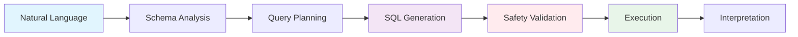
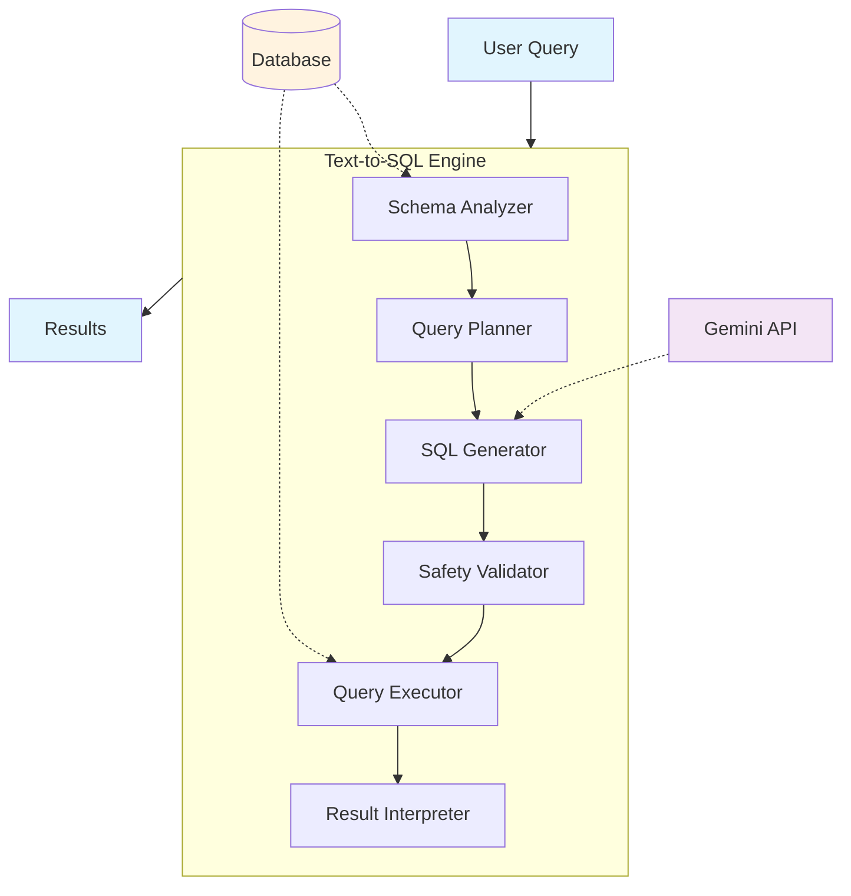
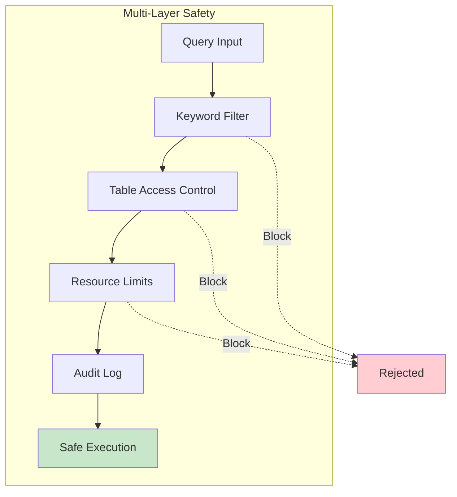
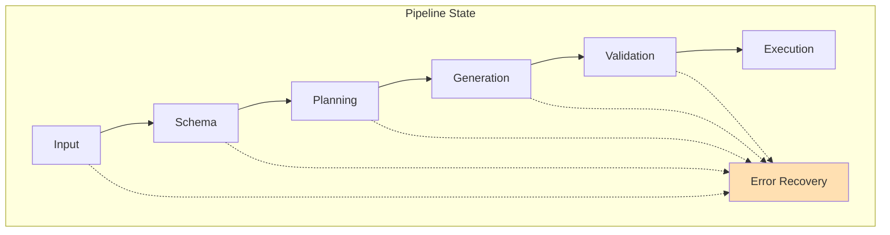
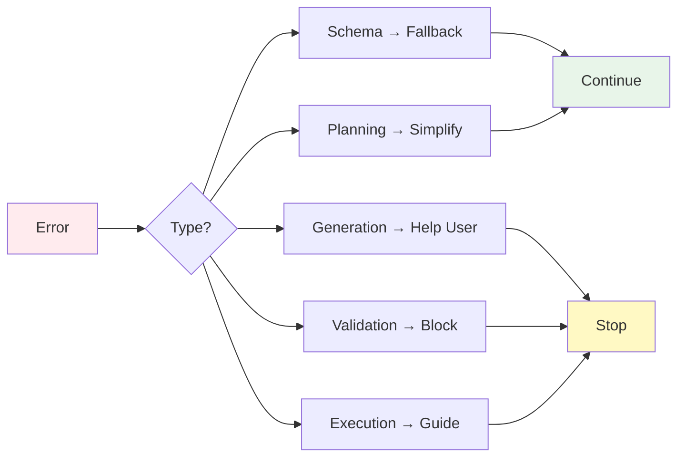

# Text-to-SQL System Architecture

## 1. Executive Summary

The Text-to-SQL system enables network operators to query infrastructure databases using natural language, eliminating the need for SQL expertise. It translates questions like "show me all routers with high CPU usage" into safe, optimized SQL queries while maintaining strict security controls.

**Core Value:** Transform complex SQL queries into simple English questions for network infrastructure management.

## 2. Problem & Solution

### 2.1 The Challenge
Network infrastructure databases contain dozens of interconnected tables with complex relationships. Network operators need quick data access but lack SQL expertise, making manual query writing error-prone and time-consuming.

### 2.2 Our Approach
A six-stage pipeline that safely converts natural language to SQL:

### 2.3 Target Domain
Built for network infrastructure management:
- **Devices**: Routers, switches, load balancers, firewalls
- **Topology**: VLANs, BGP peers, interface connections
- **Metrics**: Bandwidth, latency, packet loss, CPU usage
- **Security**: ACLs, certificates, compliance data

## 3. When to Use This System

### 3.1 Perfect Fit Scenarios
- **Analytical queries**: Aggregations (SUM, COUNT, AVG, GROUP BY)
- **10-50 interconnected tables** with clear relationships
- **Ad-hoc exploratory queries** without predefined reports
- **Direct database access** without API restrictions
- **Existing SQL infrastructure** (PostgreSQL, MySQL, Oracle)

### 3.2 Example Use Cases
**Analytics:**
- "What's the average CPU utilization by datacenter?"
- "Show monthly bandwidth growth trends"
- "Calculate 95th percentile latency this week"

**Operations:**
- "Find all routers with outdated firmware"
- "Show interfaces with >80% utilization"
- "List devices that failed in the last 24 hours"

### 3.3 Optimization Strategies
For schemas with many tables:
- **Schema filtering**: Only pass relevant tables to LLM
- **Semantic layer**: Create views to simplify complex joins
- **Progressive complexity**: Start simple, build up as needed

## 4. Architecture

### 4.1 System Overview

### 4.2 Safety Architecture

**Security Controls:**
- Blocks destructive operations (DELETE, DROP, UPDATE)
- Prevents system table access
- Enforces query timeouts and result limits
- Maintains comprehensive audit trail

### 4.3 State Management

**Benefits:** Error recovery, performance monitoring, audit logging, result caching

## 5. Implementation

### 5.1 Core Components
**Component Files:**
- **`schema_analyzer.py`** - Identifies relevant tables and relationships
- **`query_planner.py`** - Assesses complexity and creates execution strategy
- **`sql_generator.py`** - Converts natural language to SQL using Gemini API
- **`validator.py`** - Enforces security through keyword filtering and access controls
- **`executor.py`** - Executes SQL with timeout and resource monitoring
- **`interpreter.py`** - Formats results with natural language explanations

### 5.2 Error Handling

### 5.3 Integration Points

#### Database Abstraction
Supports any SQL-compliant database:
- PostgreSQL (recommended for production)
- MySQL/MariaDB
- Oracle/SQL Server
- Time-series databases (InfluxDB, TimescaleDB)

#### MCP Protocol
Exposes capabilities via Model Context Protocol for agent discovery, standardized request/response format, and integration with network management workflows.

#### Configuration
Pydantic-based configuration for database connections, LLM settings, security policies, and performance tuning.

## 6. Operations

**Safety:** Read-only access, resource limits, comprehensive audit trail

**Performance:** <30 second execution, schema caching, result limiting, connection pooling

**Reliability:** Graceful degradation, detailed error reporting, state preservation, multi-layer validation

## 7. Technology Stack

- **LangGraph** - Workflow orchestration and state management
- **Google Gemini API** - Natural language to SQL conversion
- **Database Agnostic** - Supports any SQL-compliant database
- **Model Context Protocol** - Multi-agent communication
- **Pydantic** - Type-safe configuration and validation